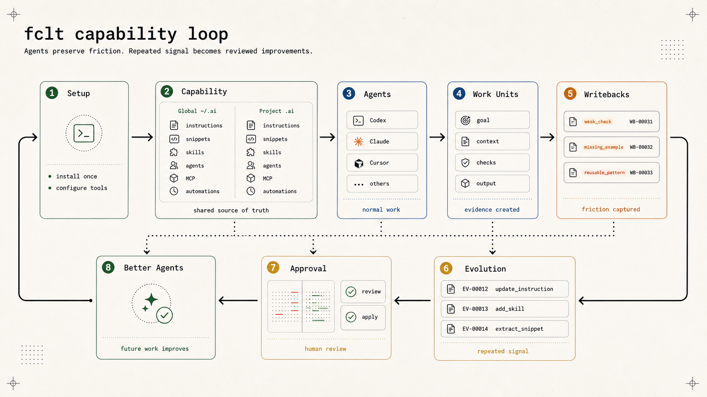

# fclt

<p align="center">
  <picture>
    <source media="(prefers-color-scheme: dark)" srcset="./docs/assets/fclt-mark-dark.svg">
    
  </picture>
</p>

<div align="center">
  <a aria-label="NPM version" href="https://www.npmjs.com/package/facult">
    
  </a>
  <a aria-label="Homebrew tap" href="https://github.com/hack-dance/homebrew-tap">
    
  </a>
  <a aria-label="Release workflow" href="https://github.com/hack-dance/fclt/actions/workflows/release.yml">
    
  </a>
  <a aria-label="hack.dance" href="https://hack.dance">
    
  </a>
</div>

`fclt` is a feedback loop for AI capability.

It captures what agents learn during real work, reconciles that signal across configured sources,
turns repeated evidence into reviewable changes, and verifies whether those changes improved the
work that produced them. Instructions, snippets, skills, agents, MCP definitions, automations, and
tool config are the capability units the loop can inspect and improve.

Use it when useful agent learning disappears into chat history, capability is scattered across
tools and repos, or the same weak instruction, missing context, and shallow verification failure
keeps returning.

<p align="center">
  
</p>

Most usage should be agent-led after setup. Humans install, inspect, audit, and approve broad changes. Agents use `fclt` to find the right capability, preserve friction as writeback, and turn repeated signal into reviewed improvements.

The basic operating unit is the work unit: a piece of agent work with a goal, context, constraints, evidence, an output artifact, verification, and a writeback target when the work teaches something reusable. That frame applies to normal coding, research, docs, setup, operations, and debugging work, not only to skill updates.

The core loop is:

```text
work -> collect signal -> prove source coverage -> correlate and decide
     -> change the smallest capability unit -> verify the outcome -> repeat
```

Signal can come from explicit writebacks, canonical Git changes, structured evidence exports,
automation logs, and configured Markdown. External trackers are optional evidence sources, never
a required backend or a default mutation target.

## What it does

`fclt` helps you:

- keep reusable AI capability in a canonical `~/.ai` root
- keep repo-specific capability in `<repo>/.ai`
- inspect skills, instructions, MCP servers, agents, automations, and rendered outputs
- compose guidance from smaller units with refs and snippets
- give agents a reusable work-unit frame for normal work
- record writebacks when an agent finds missing context, weak verification, stale guidance, or tool friction
- reconcile configured evidence so a review cannot report “nothing pending” without checking its window
- correlate repeated signal and assign an explicit disposition
- turn repeated evidence into reviewable evolution proposals and verify their outcomes
- optionally render approved capability into Codex, Claude, Cursor, and similar tools
- audit local and remote capability before it spreads

The default posture is read-first. Managed rendering is available, but it is not required for inventory, review, writeback, or evolution. The goal is a background feedback loop, not another CLI users must babysit.

## Install

Homebrew:

```bash
brew tap hack-dance/tap
brew install hack-dance/tap/fclt
fclt --version
```

npm or Bun:

```bash
npm install -g facult
# or
bun add -g facult
fclt --version
```

The npm package is named `facult` for registry compatibility. The command is `fclt`.

Then bootstrap the complete writeback/evolution loop from your home directory or a repository:

```bash
fclt setup
```

That one command safely initializes or updates global `~/.ai`, initializes the current git
repository's `<repo>/.ai` when applicable, creates review-state paths, rebuilds capability
discovery, and installs the Codex plugin when Codex is available. It preserves local edits and
existing WB/EV history, and it is safe to run again. Use `fclt setup --global-only` outside a
project or `fclt setup --no-codex-plugin` for a CLI-only install.

One-off usage:

```bash
npx --yes -p facult fclt --help
```

Direct binary install for macOS or Linux:

```bash
curl -fsSL https://github.com/hack-dance/fclt/releases/latest/download/fclt-install.sh | bash
```

Windows and manual installs can download binaries from the [latest release](https://github.com/hack-dance/fclt/releases/latest).

Check setup and exact repair actions:

```bash
fclt doctor --json
fclt doctor --repair
```

To run the review loop on a schedule, opt in explicitly:

```bash
fclt ai loop enable --project
fclt ai loop status --project --json
```

The loop keeps a durable full queue while suppressing unchanged notification
noise. It reconciles read-only sources and prepares review artifacts; automatic
canonical apply remains plan-only until a transaction-safe apply contract is
available. Disable it without deleting history with `fclt ai loop disable
--project`.

`doctor --json` is read-only and includes `loop` readiness for canonical roots, writable runtime
and review state, asset targeting, required skills, reconciliation, scheduled-loop health, and
Codex registration/discovery. External trackers are not required by the core loop; configure a
local evidence export only when tracker events should participate in reconciliation. Codex
registration is reported separately from fresh-session tool discovery.

`doctor --repair` is the self-heal path for legacy
state, broken rendered global guidance, missing review artifacts, and stale
local integration layout. It validates the rendered form of `AGENTS.global.md`
while preserving that file as a composable source template, and it repairs
leaked `${refs.*}` placeholders in direct-readable instruction files. Canonical
repairs keep a backup under `.ai/.facult/backups/doctor/`.

Update an installed binary:

```bash
fclt self-update
fclt self-update --version 2.12.0
```

`self-update` follows the active install mode. It updates release-script binaries
directly, npm/Bun global installs through their package manager, and
mise-managed npm installs with `mise use -g --pin npm:facult@<version>`, then
verifies the active `fclt --version`.

## Quick start

### 1. Bootstrap the loop

```bash
fclt setup
fclt doctor --json
```

### 2. Capture or reconcile real-work signal

Agents can record one durable observation directly:

```bash
fclt ai writeback add \
  --kind missing_context \
  --summary "The runbook did not identify the production verification path" \
  --evidence run:production-verification \
  --asset instruction:VERIFICATION
```

Or review a bounded window across every configured source:

```bash
fclt ai review status --json
fclt ai review reconcile --since 2026-07-01 --until 2026-07-08 --json
```

The result records coverage, correlations, exclusions, linked work, and one disposition for every
included signal. Empty is valid only when configured coverage proves the window was checked.

### 3. Inspect existing AI state

Start read-only:

```bash
fclt status
fclt scan --show-duplicates
fclt inventory --json
fclt list skills
fclt find verification
```

Useful flags:

```bash
fclt inventory --json --global
fclt inventory --json --project
fclt inventory --json --tool codex
```

`inventory` is the stable JSON surface for agents and automation. It redacts MCP secrets by default while preserving safe metadata such as env references and whether inline secrets were detected.

### 4. Advanced: create a canonical store manually

Install the built-in operating-model pack into the global root:

```bash
fclt templates init operating-model --global
fclt index --global
```

On first install, `fclt` seeds `AGENTS.global.md` from existing global agent docs such as `~/.codex/AGENTS.md` or `~/.claude/CLAUDE.md` when they exist, then appends the Facult operating-model frame. The packaged template is only the fallback.

Refresh an existing operating-model pack without overwriting local edits:

```bash
fclt templates init operating-model --global --update --dry-run
fclt templates init operating-model --global --update
```

Create a repo-local `.ai` root:

```bash
cd /path/to/repo
fclt templates init project-ai
fclt status --project
```

Create individual capability units:

```bash
fclt templates init instruction LANGUAGE
fclt templates init snippet global/policy/review
fclt templates init skill project-review
fclt templates init agent review-operator
```

### 5. Consolidate existing skills or config

Bring existing tool-native assets into a canonical root deliberately:

```bash
fclt consolidate --auto keep-current --from ~/.codex/skills --from ~/.agents/skills
fclt index
```

`keep-current` is deterministic and non-interactive. Use other conflict modes only when you have reviewed the sources.

### 6. Legacy managed-mode inspection

Broad managed mode is deprecated and contained by default because it can own or restore unrelated
tool-home surfaces without a transaction receipt. Keep using inventory and previews while the
per-asset deployment replacement is built.

```bash
fclt setup codex-plugin
fclt manage codex --dry-run
fclt sync codex --dry-run
fclt unmanage codex --dry-run
```

The narrow `setup codex-plugin` path remains supported and does not enter managed mode. Existing
legacy installations may use `--allow-legacy-managed-mutation` only for an explicitly reviewed
migration. Do not use the escape hatch for ordinary sync, background autosync, or stale-backup
restoration. A legacy autosync service may be run once with explicit approval; install, restart, and
continuous run remain disabled.

Project-managed sync remains default-deny. Repo-local tool outputs only receive assets that the
project explicitly allows.

## Core model

`fclt` separates source, generated state, runtime state, review artifacts, and rendered output.

```text
~/.ai/                    global canonical capability
<repo>/.ai/               project canonical capability
~/.ai/writebacks/         markdown review artifacts
~/.ai/evolution/          markdown proposal artifacts
tool homes                rendered output for Codex, Claude, Cursor, etc.
machine-local fclt state  queues, drafts, indexes, managed state, runtime cache
```

Canonical capability can include:

- `instructions/`: reusable markdown doctrine
- `snippets/`: composable blocks inserted into rendered markdown
- `skills/`: workflow-specific capability folders
- `agents/`: delegated roles
- `mcp/`: MCP server definitions and overlays
- `automations/`: scheduled review loops
- `tools/<tool>/`: tool config and rules
- `snippets/templates/agents-global.md`: source template materialized as `AGENTS.global.md`

Refs let markdown point at canonical assets without hard-coding paths:

```text
@ai/instructions/LANGUAGE.md
@project/instructions/TESTING.md
@builtin/facult-operating-model/instructions/WORK_UNITS.md
```

Snippet markers let repeated blocks stay independently editable:

```md
<!-- fclty:global/policy/review -->
<!-- /fclty:global/policy/review -->
```

The rule is simple: target the smallest unit that needs to change. Use instructions for doctrine, snippets for repeated blocks, skills for workflows, agents for roles, MCP/tool config for interfaces, and automations for scheduled loops.

Work units give those assets a practical operating frame. They keep intent, evidence, verification, output, and learning attached to a task so repeated friction can become writeback and evolution instead of disappearing into chat history.

## Writeback and evolution

Writeback is preserved signal from real work. Evolution turns repeated signal into reviewed changes.

Record one targeted writeback when the signal is durable:

```bash
fclt ai writeback add \
  --kind weak_verification \
  --summary "Checks were too shallow" \
  --asset instruction:VERIFICATION
```

Review accumulated signal:

```bash
fclt ai review reconcile --since 2026-07-03 --until 2026-07-10 --json
fclt ai writeback list
fclt ai writeback group --by asset
fclt ai writeback summarize --by kind
```

`fclt setup` creates a safe `reconciliation.json` beside the selected canonical
root. Global setup checks explicit writebacks automatically; project setup also
checks Git history for canonical assets. Vendor-neutral evidence exports,
automation logs, and Markdown sources are opt-in. Every review records source coverage, cursors, extraction
decisions, correlations, exclusions, linked work, and a disposition. An empty
review is valid only when every configured source was checked.
Configure Markdown sources as narrow append-only or date-headed evidence
streams rather than broad workspace globs; undated sections use file
modification time and may otherwise make old material look current.
Bounded reviews rescan the full requested window; `--incremental` explicitly
opts into advancing from stored watermarks. Use `fclt ai review init --force`
to back up and replace an invalid reconciliation config.

Draft a proposal only when the evidence repeats, a capability is clearly missing, or a canonical asset is stale:

```bash
fclt ai evolve assess --asset instruction:VERIFICATION --json
fclt ai evolve propose
fclt ai evolve list
fclt ai evolve draft EV-00001
fclt ai evolve review EV-00001
fclt ai writeback link WB-00001 --issue TEAM-123
fclt ai writeback disposition WB-00001 --type task --target TEAM-123
fclt ai evolve verify EV-00001 --effectiveness improved --evidence test:post-apply
```

Evolution is complete only after outcome verification. Applying a proposal preserves its source
signal until evidence grades the result as improved, unchanged, regressed, or inconclusive.

Project-scoped additive markdown changes can be lower risk. Global instructions, shared skills, plugins, and other broad surfaces require review before apply.

## Built-in pack

`fclt` ships an operating-model pack that teaches agents how to work in loops instead of one-off prompts:

- define work units
- verify meaningfully
- compose capability units
- record writebacks
- synthesize repeated signal into proposals
- decide project vs global scope
- respect managed-mode ownership boundaries

Install it without managing any tool:

```bash
fclt templates init operating-model --global
fclt templates init operating-model --project
fclt templates init operating-model --root /path/to/.ai
fclt templates init operating-model --global --update
```

The pack is also available as built-in refs under:

```text
@builtin/facult-operating-model/...
```

## Automation

`fclt` can scaffold Codex automations for recurring review loops:

```bash
fclt templates init automation learning-review \
  --scope project \
  --project-root /path/to/repo \
  --status PAUSED

fclt templates init automation evolution-review \
  --scope wide \
  --cwds /path/to/repo-a,/path/to/repo-b \
  --status PAUSED

fclt templates init automation tool-call-audit \
  --scope project \
  --project-root /path/to/repo \
  --status PAUSED
```

Use `learning-review` to preserve signal, `evolution-review` to triage proposals, and `tool-call-audit` to find repeated tool friction.

## Security and trust

Remote capability should be reviewed before broad use.

```bash
fclt sources list
fclt verify-source skills.sh --json
fclt sources trust skills.sh --note "reviewed"
fclt install skills.sh:code-review --as code-review-skills-sh --strict-source-trust
```

Audit local capability:

```bash
fclt audit
fclt audit --non-interactive --severity high
fclt audit fix mcp:github
```

Keep tracked MCP config secret-free. Use local overlays such as `mcp/servers.local.json` for machine-specific secrets.

## Command Map

Discovery:

```bash
fclt setup [--global-only] [--no-codex-plugin] [--json]
fclt status [--json]
fclt doctor [--json] [--repair]
fclt paths [--json]
fclt scan [--from <path>] [--json] [--show-duplicates]
fclt inventory [--json] [--tool <name>] [--show-secrets]
fclt list [skills|mcp|agents|snippets|instructions|automations]
fclt show <selector>
fclt find <query>
fclt graph show <selector>
fclt graph deps <selector>
fclt graph dependents <selector>
```

Canonical store:

```bash
fclt templates list
fclt templates init operating-model [--global|--project|--root PATH] [--update]
fclt templates init project-ai [--update]
fclt templates init instruction <name>
fclt templates init snippet <marker>
fclt templates init skill <name>
fclt templates init agent <name>
fclt consolidate --auto keep-current --from <path>
fclt index [--force]
```

Legacy managed-mode inspection:

```bash
fclt setup codex-plugin [--dry-run] [--json] [--no-codex-install]
fclt manage <tool> --dry-run
fclt sync [tool] --dry-run
fclt managed
fclt unmanage <tool> --dry-run
```

Writeback and evolution:

```bash
fclt ai writeback add --kind <kind> --summary <text> --asset <selector>
fclt ai writeback list|show|group|summarize
fclt ai evolve assess|propose|list|show|draft|review|accept|reject|apply|promote
fclt ai review init|status|reconcile
```

Sources, audit, and updates:

```bash
fclt search <query>
fclt install <source:item> [--as <name>] [--strict-source-trust]
fclt update [--apply]
fclt sources list|trust|review|block|clear
fclt verify-source <name>
fclt audit [--non-interactive]
fclt self-update
```

Use `fclt --help` and `fclt <command> --help` for exact flags.

## Documentation

Start with:

- [Concepts](./docs/concepts.md): roots, scopes, state layers, and asset types
- [Work Units](./docs/work-units.md): general-purpose agent work framing
- [Composable Capability](./docs/composable-capability.md): refs, snippets, instruction templates, and evolvable units
- [Project `.ai`](./docs/project-ai.md): repo-owned capability and project sync policy
- [Built-in pack](./docs/built-in-pack.md): packaged work-unit, writeback, and evolution defaults
- [Built-in pack upgrades](./docs/pack-upgrades.md): non-destructive refresh behavior for existing `.ai` roots
- [Codex plugin](./docs/codex-plugin.md): installable Codex skills and MCP tools for fclt workflows
- [Writeback and evolution](./docs/writeback-evolution.md): the feedback-loop workflow and review surfaces
- [Managed mode](./docs/managed-mode.md): when to let `fclt` write tool files
- [Roadmap](./docs/roadmap.md): current gaps and planned work

## Brand assets

The fclt mark represents composable capability moving through a continuous improvement loop. Use the [SVG master](./docs/assets/fclt-mark.svg) for scalable applications or the [transparent 1024 px PNG](./docs/assets/fclt-mark.png) for raster surfaces. A [white SVG variant](./docs/assets/fclt-mark-dark.svg) is available for dark backgrounds.

## FAQ

### Does fclt run an MCP server?

The core product is still CLI-first. `fclt setup codex-plugin` installs the first-party Codex plugin without putting all of Codex under managed mode. The plugin includes a small stdio MCP wrapper that delegates to the installed `fclt` binary for status, doctor, paths, setup, writeback, and evolution workflows. See [Codex plugin](./docs/codex-plugin.md).

### Why do fclt tools not appear in an existing Codex task?

Codex captures a task's tool registry when that task starts. Installing the plugin, restarting the
app, and then resuming the same task does not rewrite that task's registry. Run `fclt setup
codex-plugin`, confirm `codex plugin list` reports `fclt` as enabled, and create a genuinely new
task. Registration and MCP self-test are useful checks, but only a new task calling `fclt_status`
proves desktop discovery.

### Does fclt have to manage Codex or Claude files?

No. You can use `status`, `scan`, `inventory`, `list`, `show`, `graph`, `writeback`, and `evolve` without managed rendering. Broad managed apply is deprecated and contained; use `manage --dry-run` and `sync --dry-run` only to inspect legacy plans while per-asset deployment is built.

### Where do project writebacks go?

Runtime JSON state stays machine-local. Human-readable review artifacts are mirrored under global `~/.ai/writebacks/projects/<slug-hash>/` and `~/.ai/evolution/projects/<slug-hash>/`, not inside repo-local `<repo>/.ai`.

### What should be committed?

Commit canonical project assets that belong to the repo: instructions, snippets, skills, agents, MCP definitions without secrets, and project sync policy. Do not commit generated state, machine-local review queues, rendered tool outputs, or secrets.

## Contributing

Contributor and release workflow details live in [CONTRIBUTING.md](./CONTRIBUTING.md).

## Background

The operating model behind `fclt` is related to the argument in [Governing the Machine](https://www.hack.dance/writing/governing-the-machine): as machine execution gets cheaper, the hard problem becomes governing work, evidence, memory, integration, and improvement.
